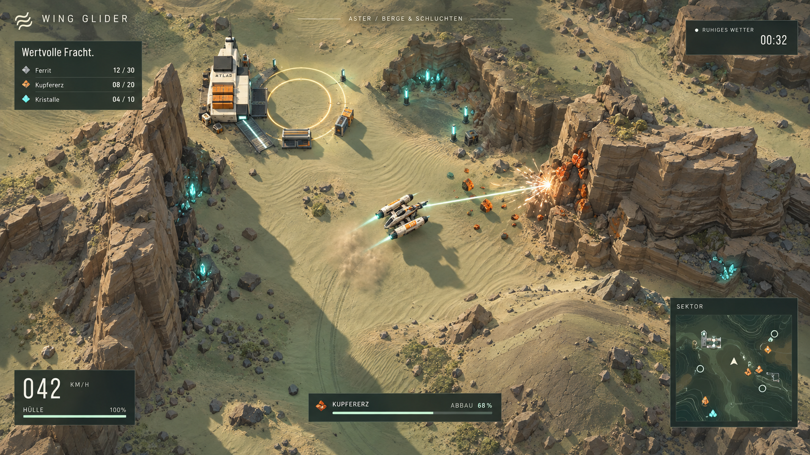
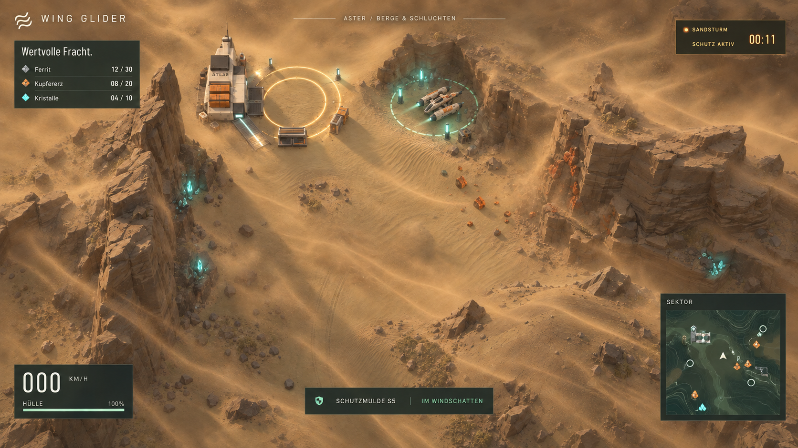
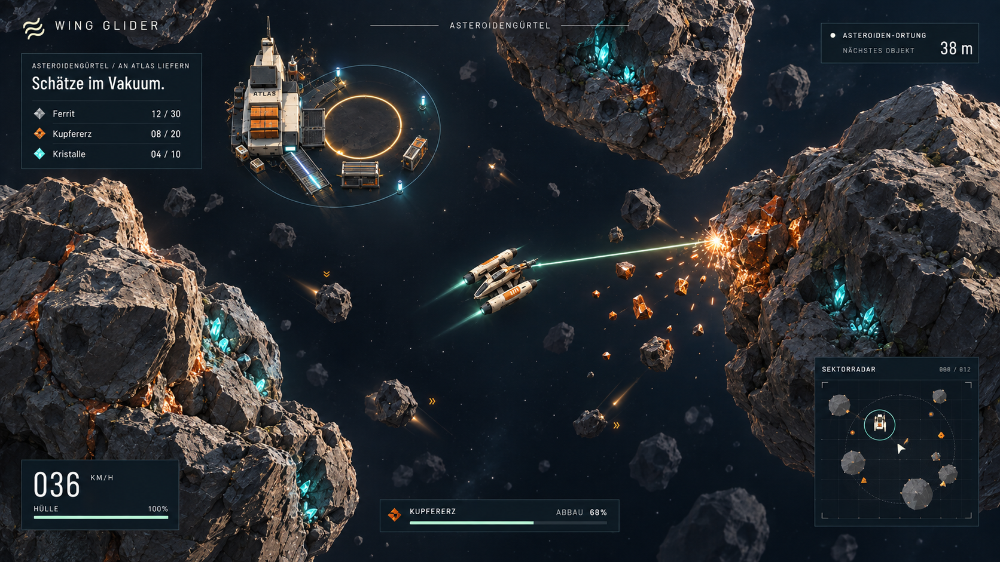
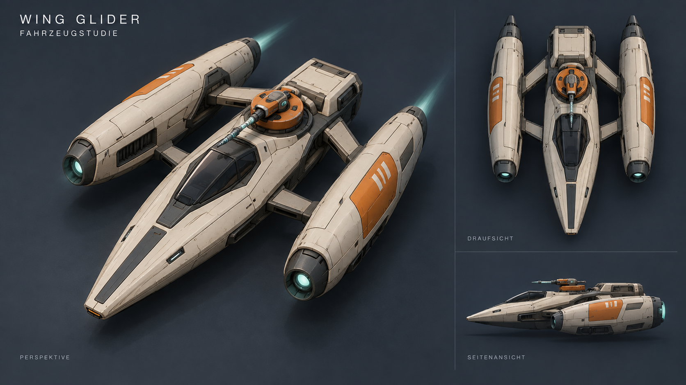

# Wing Glider – visuelle Mockups

Vier zusammengehörige Konzeptbilder, erstellt am 27.09.2026 mit dem integrierten Imagegen-Tool. Grundlage sind die vorhandenen Screenshots und die Gestaltung des aktuellen Fahrzeugs. Die Bilder zeigen eine mögliche visuelle Zielrichtung.

## Aster: Landschaft und Abbau

Geschichtete Felswände, Sandrippen, Geröll und klar unterscheidbare Erzvorkommen. Warmes Seitenlicht, weiche Schatten, kurze Triebwerksspuren und lokalisierte Abbaueffekte sorgen für Tiefe und Orientierung.

## Aster: Sandsturm

Dieselbe Landschaft mit gerichteten Staubbändern, gedämpftem Licht und einer sichtbar ruhigeren Schutzmulde. Leuchtende Beacons und eine dezente Bodenmarkierung kennzeichnen den sicheren Bereich.

## Asteroidengürtel

Unregelmäßige, zerklüftete Asteroiden, Erzadern in Felsspalten und unterschiedlich weit entfernte Trümmer. Dunkle Freiflächen lassen Flugrouten lesbar; Streiflicht und sparsame Leuchteffekte setzen Akzente. ATLAS erhält einen deutlichen Ladebereich und einen dezenten Schildrand.

## Fahrzeugstudie

Flacher Keilrumpf, längere Nase, schlanke seitliche Triebwerksgondeln und ein kompakter drehbarer Abbauaufsatz. Elfenbein, Graphit und Orange führen die vorhandene Farbgebung weiter. Gezeigt sind Perspektive, Draufsicht und Seitenansicht.

Die Spielansichten verwenden kleinere HUD-Flächen, damit Landschaft und Effekte mehr Platz erhalten. HUD-Werte sind illustrative Beispieldaten. Die Bilder sind Gestaltungskonzepte; Geometrie, Texturen, Shader und Effekte müssten für die laufende Three.js-Version separat umgesetzt und auf Leistung geprüft werden.

Alle vollständigen Prompts und Bildreferenzen stehen in [PROMPTS.md](PROMPTS.md).

